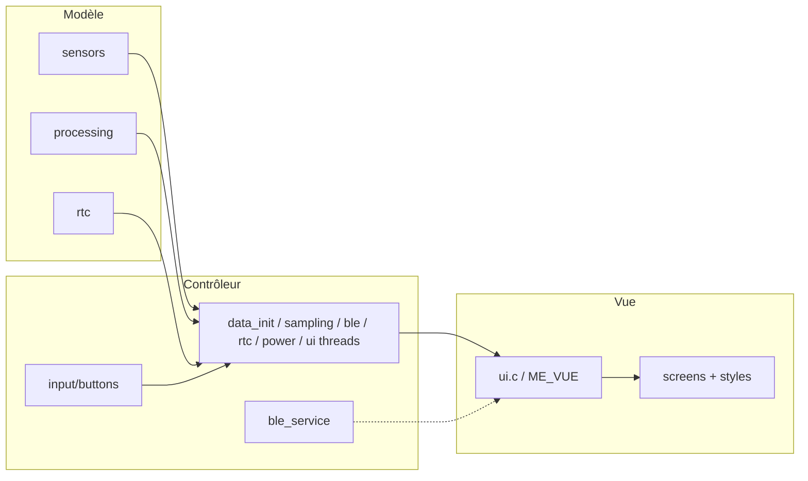

# Acheminement des données et des événements

Ce document décrit **comment l’information circule** dans ZSWatch : du matériel et des algorithmes vers l’écran, et des actions utilisateur vers la navigation ou la gestion d’énergie.

## Vue synthétique

---

## 1. Démarrage (ordre dans `main.c`)

1. **`buttons_init()`** — configure les GPIO boutons ; les callbacks tournent dans le contexte **ISR** (interruption).
2. **`data_init_thread_start()`** — thread qui initialise capteurs + RTC + contexte partagé (`DataInitContext`).
3. **`ui_thread_start()`** — attend la fin de l’init données, puis initialise LVGL / `ME_VUE` et boucle affichage.
4. Après 100 ms : **`sampling_thread_start()`**, **`ble_thread_start()`**, **`rtc_thread_start()`**, **`power_thread_start()`**.
5. **`main`** reste en sommeil : le travail est dans les **threads**.

Ce séquencement garantit que l’UI ne démarre pas avant que `data_init` ait préparé le matériel.

---

## 2. Flux « Modèle → Écran » (données affichées)

### Étape A — Initialisation matérielle (`data_init_thread`)

- Ouvre / configure **mouvement**, **environnement**, **magnétomètre**, **RTC**.
- Remplit un **`DataInitContext`** (handles de capteurs, flags `*_ready`).
- Les autres threads appellent `data_init_thread_wait_ready()` avant d’utiliser ce contexte.

### Étape B — Échantillonnage périodique (`sampling_thread`)

- Timer Zephyr → réveil du thread de sampling.
- Lit les capteurs via le contexte, exécute les modules **`processing/`** (pas, distance, calories, compas, activité, météo simplifiée, altimètre, étages, chute, etc.).
- Agrège le tout dans une structure **`SamplingData`** (mutex + dernière copie valide).
- Met à jour le **service BLE** (`ble_service_update`) pour les clients connectés.
- Notifie l’activité au **`power_thread`** (réveil / sortie éco).

### Étape C — Horloge (`rtc_thread`)

- Boucle : lecture RTC et log (affichage série). Le **temps affiché à l’écran** est lu par le **`ui_thread`** via `watch_rtc_get()` sur le même `WatchRTC` du contexte.

### Étape D — Rafraîchissement de la vue (`ui_thread`)

Toutes les **`UI_MODEL_REFRESH_MS`** (200 ms par défaut), si l’écran n’est pas en veille :

1. **`ui_thread_refresh_model(&ui_model)`** remplit un **`view_model_data_t`** :
   - depuis **`DataInitContext`** + **`watch_rtc_get`** : date/heure ;
   - depuis **`sampling_thread_get_latest_copy`** : pas, température, humidité, pression, distance, calories, cap, activité, tendance météo, altitude, étages, chute ;
   - depuis **`ble_service`** : connexion, RSSI (placeholder batterie côté UI).
2. **`ui_update(&ui_model)`** → **`ME_VUE_update`** → **`view_screens_update`** : les labels / widgets LVGL des écrans actifs sont mis à jour.

**Résumé :** le « modèle » applicatif vu par LVGL est un **snapshot** reconstruit dans `ui_thread`, pas un objet unique global partagé partout.

---

## 3. Flux « Utilisateur → Comportement » (événements)

### Boutons physiques (`input/buttons`)

- **SW0** (selon configuration) : en mode normal, enregistre **`BUTTON_EVENT_NEXT_SCENE`** ; consommé par **`ui_thread`** → **`ME_VUE_show_next_screen()`** (enchaînement d’écrans).
- Debounce logiciel ; **`power_thread_notify_activity()`** à chaque action pertinente pour repousser le mode éco.

### Mode éco (`power_thread`)

- Si inactivité prolongée : **`power_thread_is_eco_mode()`** devient vrai.
- **`ui_thread`** charge un **écran noir** (`sleep_screen`) et cesse de rafraîchir le modèle LVGL jusqu’à sortie du mode éco.

### Événements « vue » (`view_events.h`)

- Les IDs (`VIEW_EVENT_NAV_HOME`, swipe, etc.) définissent un **contrat** pour router la navigation.
- **`me_vue.c`** implémente un **`default_view_event_cb`** qui appelle **`ME_VUE_show_screen`** selon l’événement (si aucun callback personnalisé n’est fourni à l’init).
- **`ME_VUE_send_event`** permet d’injecter des événements vers ce callback (typiquement pour brancher plus tard une logique « contrôleur » dédiée).

### BLE (`ble_thread` + `ble_service`)

- Thread dédié : LED, timing, synchronisation avec les mises à jour capteurs.
- **`ble_service`** : stack Bluetooth, GATT, notifications ; **`ui_thread`** interroge seulement l’**état** (connecté, RSSI) pour l’affichage.

---

## 4. Synchronisation et concurrence

- **`SamplingData`** : mutex dans `sampling_thread` pour une lecture sûre par `ui_thread`.
- **`DataInitContext`** : accès après `data_init_thread_wait_ready` ; le RTC est partagé entre `rtc_thread` et `ui_thread` (lectures).
- **LVGL** : **`lv_timer_handler`** et toute création d’objets LVGL sont confinés au **`ui_thread`** (usage standard Zephyr + LVGL).

---

## 5. Fichiers pivots (points de jonction)

| Fichier / symbole | Rôle dans l’acheminement |
|-------------------|---------------------------|
| `DataInitContext` | Socle matériel partagé après init |
| `SamplingData` / `sampling_thread_get_latest_copy` | Valeurs agrégées capteur + algo → UI |
| `view_model_data_t` | Snapshot affichable, rempli dans `ui_thread` |
| `ui_thread.c` | Pont principal **Modèle + BLE state → Vue** |
| `me_vue.c` | Orchestration écrans LVGL + transitions |
| `view_events.h` | Vocabulaire événements vue ↔ logique |
| `buttons.c` | Entrée physique → bits d’événements + power |

Ce document se complète avec [vue.md](vue.md), [controller.md](controller.md) et [model.md](model.md) pour le détail fichier par fichier.
